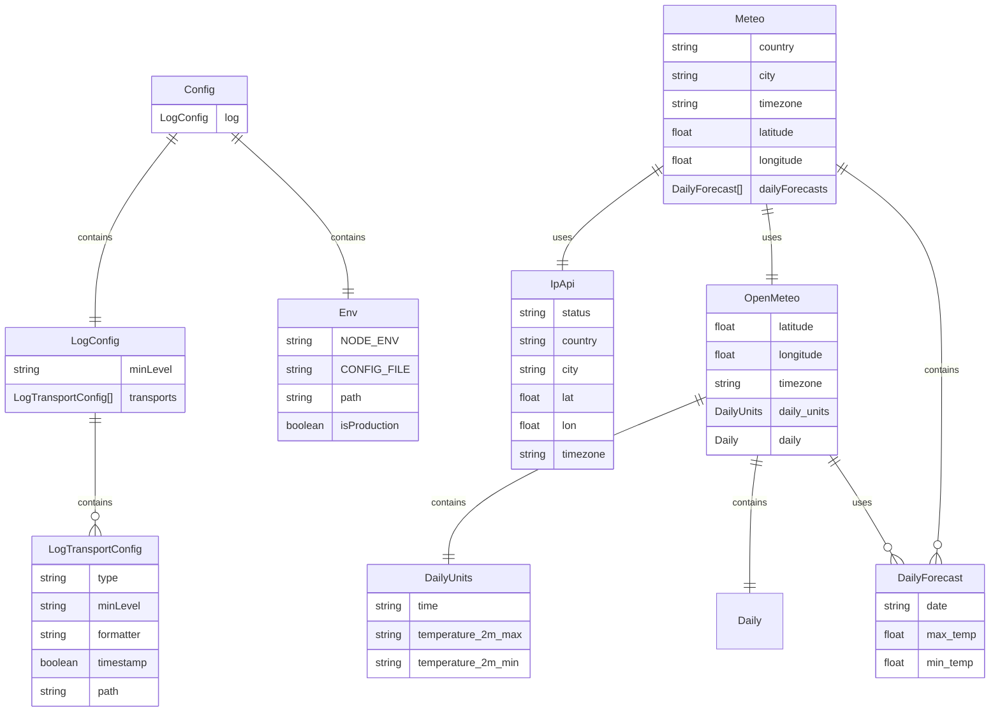

# Domain Model Blueprint

## Entities and Attributes

### Env

- **NODE_ENV**: The environment in which the application is running
- **CONFIG_FILE**: The configuration file to use
- **path**: The path to the current working directory
- **isProduction**: Whether the application is running in production mode

### Config

- **log**: The log configuration

### LogConfig

- **minLevel**: The minimum  log level
- **transports**: The log transports

### LogTransportConfig

- **type**: The log transport type. Example: `console`, `file`, `http`
- **minLevel**: The minimum log level to use this transport
- **formatter**: The log formatter. Example: `json`, `pretty`, `csv`
- **timestamp**: Whether to include a timestamp in the log
- **path**: The path to the log file (if applicable). Example: `log.csv`

### Meteo

- **country**: The country of the current location
- **city**: The city of the current location
- **timezone**: The timezone of the current location
- **latitude**: The latitude of the current location
- **longitude**: The longitude of the current location
- **dailyForecasts**: The daily forecasts

### DailyForecast

- **date**: The date of the forecast
- **max_temp**: The maximum temperature
- **min_temp**: The minimum temperature

### IpApi

- **status**: The status of the IP address
- **country**: The country of the IP address
- **city**: The city of the IP address
- **lat**: The latitude of the IP address
- **lon**: The longitude of the IP address
- **timezone**: The timezone of the IP address

> Other attributes are not used in this archetype but are part of the IP API response

### OpenMeteo

- **latitude**: The latitude of the current location
- **longitude**: The longitude of the current location
- **timezone**: The timezone of the current location
- **daily_units**: What units are used for the daily forecasts
- **daily**: The daily forecasts with arrays of data

### DailyUnits

- **time**: The time of the forecast
- **temperature_2m_max**: The maximum temperature
- **temperature_2m_min**: The minimum temperature

## Relationships

- **Config** contains one **LogConfig**
- **Config** contains one **Env**
- **LogConfig** contains many **LogTransportConfig**
- **Meteo** uses one **IpApi** to get location information
- **Meteo** uses one **OpenMeteo** to get weather forecasts
- **Meteo** contains many **DailyForecast**
- **OpenMeteo** contains one **DailyUnits**
- **OpenMeteo** contains many daily forecasts through **daily** property

## Entity-Relationship Diagram

