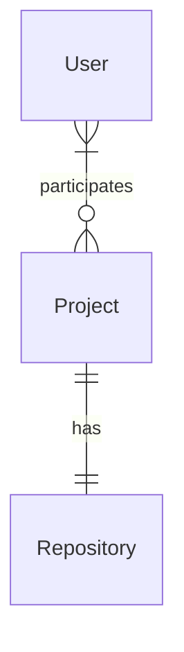

<!--
  Read the following reference documents before continue
  - [Briefing Blueprint](/docs/briefing.blueprint.md)
  - [Feature Blueprints](referenced in the context references section of the briefing blueprint)
-->

# Data Model for **{{ projectName }}**

This document describes the data model for the **{{ projectName }}** project. It covers the primary entities, their attributes, relationships, and provides a visual representation using a Entity-Relationship diagram.

It aims to establish a shared understanding (ubiquitous language) for business logic and system design.

## Entities

<!--
This is the most critical part of the data model.
- Think deeply about the entities and their relationships.
- Evaluate 2-3 options and choose the simplest one.
- After having the entities, think about the attributes.
- Then write the entities and relationships following the template below.
- Most of those entities will be persisted or loaded from a repository, but this is not a requirement. 
- The data model is a conceptual representation of the system's structure and behavior. 
- Include whatever you think is relevant for the project.
-->

{{ for entity in entities }}

### {{ entity.name | PascalCase }}

- {{ entity.description  | one short sentence }}
- **Attributes**:
  <!--
  If attribute is optional add ? suffix to the attribute name
  If attribute is unique add ! suffix to the attribute name
  -->
  {{ for attribute in entity.attributes }}
  - **{{ attribute.name | camelCase }}**: {{ attribute.type }}
  {{ end attribute }}

{{ end entity }}

<!-- Example outcome:
```md
### User
- Is a person that can login into the system
- **Attributes**:
  - **name!**: string
  - **email!**: string
  - **password!**: string
  - **role**: enum (admin, user)
  - **localePreference**: enum (en, es, fr, de)
  - **createdAt!**: date
  - **updatedAt?**: date
```
-->

## Relationships

<!--
Mention the entity that participates in the relationship
Express cardinality and participation using natural language
-->

{{ for relationship in relationships }}

- {{ relationship description  | one short sentence }}

{{ end relationship }}

<!-- Example outcome:
```md
- User can participate in many projects
- A project is asigned to many users
- Project must have one repository
- A repository is linked to one project
```
-->


## Entity-Relationship Diagram

<!-- 
Draw the [entity relationship diagram](https://mermaid.js.org/syntax/entityRelationshipDiagram.html)  
-->

```mermaid
{{ entity relationship diagram | mermaid diagram }}
```

<!--Example outcome:

-->

## Context references

- [Briefing Blueprint](/docs/briefing.blueprint.md)


> End of Data Model Document for `{{ projectName }}`
