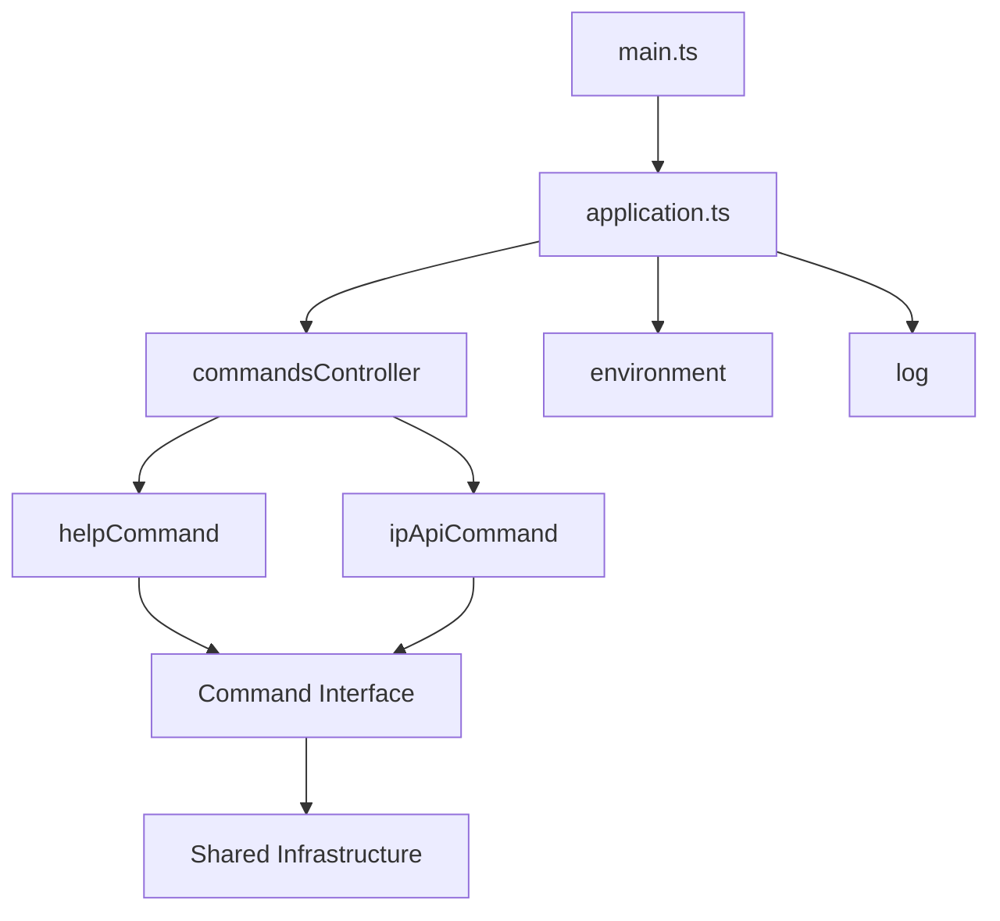
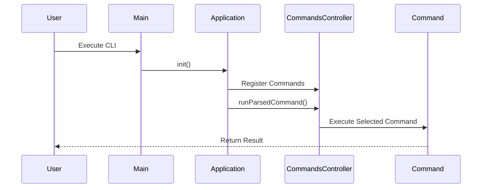

# c0-node-cli Architecture

## Technical Context

The c0-node-cli is a Node.js command-line interface application built with TypeScript. It follows a modular architecture pattern with clear separation of concerns and dependency injection principles. The application is designed to be extensible, allowing new commands to be added easily while maintaining a consistent structure.

### Core Components

1. **Application Core**
   - Entry point (`main.ts`) initializes the application
   - Application module (`application.ts`) orchestrates command registration and execution
   - Environment configuration management
   - Logging service for consistent output

2. **Command System**
   - Command controller for managing and executing commands
   - Modular command structure with separate implementations
   - Built-in commands:
     - `help`: Displays available commands and usage
     - `ip`: IP API integration for IP information lookup

3. **Shared Infrastructure**
   - Environment configuration adapter
   - Logging service
   - Type definitions
   - CLI utilities

## Architecture Diagram

## Feature Execution Flow

## Design Principles

1. **Modularity**: Each command is self-contained and follows a consistent interface
2. **Extensibility**: New commands can be added without modifying existing code
3. **Error Handling**: Comprehensive error handling and logging throughout the application
4. **Type Safety**: Full TypeScript implementation with strict type checking
5. **Configuration**: Environment-based configuration with type safety

## Best Practices

1. **Code Organization**
   - Clear directory structure
   - Separation of concerns
   - Modular command system

2. **Error Handling**
   - Consistent error logging
   - Graceful error recovery
   - User-friendly error messages

3. **Type Safety**
   - Strict TypeScript configuration
   - Interface-driven development
   - Type definitions for all components

4. **Testing**
   - Command-specific test suites
   - Integration tests for command execution
   - Environment configuration testing

## Future Considerations

1. **Command Plugin System**
   - Dynamic command loading
   - External command support
   - Plugin versioning

2. **Enhanced Logging**
   - Structured logging
   - Log levels
   - Log persistence

3. **Configuration Management**
   - User configuration
   - Command-specific settings
   - Configuration validation

4. **Performance Optimization**
   - Command execution profiling
   - Resource usage monitoring
   - Caching strategies

