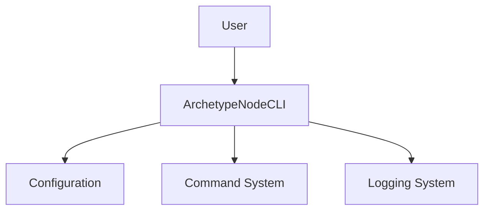

# **ArchetypeNodeCLI** Briefing

**ArchetypeNodeCLI** is a CLI for Node.js developers that _provides a standardized template and structure for creating new Node.js CLI applications_

## Features

### F1 Project Initialization

- Automatically sets up a new Node.js CLI project with best practices and standard structure

- [f1-project-initialization.blueprint.md](/docs/f1-project-initialization.blueprint.md)

### F2 Configuration System

- Provides a flexible configuration system with environment variables, config files, and defaults

- [f2-configuration-system.blueprint.md](/docs/f2-configuration-system.blueprint.md)

### F3 Command Management

- Implements a robust command system with argument parsing, help generation, and options support

- [f3-command-management.blueprint.md](/docs/f3-command-management.blueprint.md)

### F4 Logging and Error Handling

- Implements comprehensive logging and error handling with different verbosity levels

- [f4-logging-error-handling.blueprint.md](/docs/f4-logging-error-handling.blueprint.md)

## Context diagram

- [Domain Model](/docs/domain-model.blueprint.md)

---

## System Specifications and Containers

- **Interaction**: CLI
- **Authentication**: none
- **Integrations**: none
- **Monitoring**: operational
- **Persistence**: file_system

### C1 ArchetypeNodeCLI

- A node-cli that provides a standardized template and structure for creating new Node.js CLI applications

- [Systems architecture](/docs/systems-architecture.blueprint.md)

## Credits

- **Author**: [Alberto Basalo](https://albertobasalo.dev)
- **Company**: [AI code Academy](https://aicode.academy)
- **Repository**: [ArchetypeNodeCLI](https://github.com/AIcodeAcademy/ArchetypeNodeCLI)

## Related Blueprints

- [Domain Model Blueprint](/docs/domain-model.blueprint.md)

> End of Briefing Document for `ArchetypeNodeCLI` 