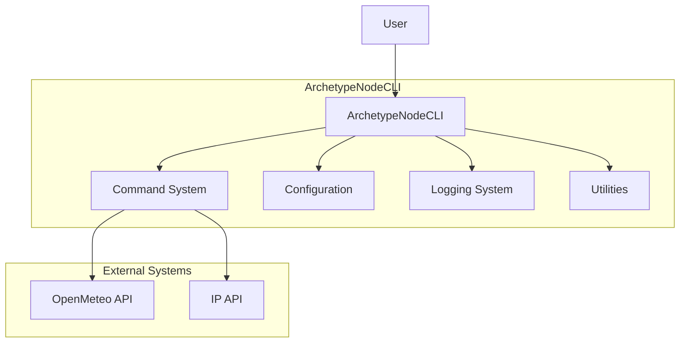

# `ArchetypeNodeCLI` Briefing

`ArchetypeNodeCLI` is a CLI for Node.js developers that _provides a standardized template and structure for creating new Node.js CLI applications_

## Features

### F1 Project Initialization

- Vanilla Node.js CLI project with best practices, dev tools and standard structure

### F2 Configuration System

- Flexible configuration system with environment variables, config files, and defaults

### F3 Utilities

- Wraps and adapts external or built-in frameworks dependencies for http, crypto, fs, etc.

### F4 Logging and Error Handling

- Comprehensive logging and error handling with different verbosity levels

### F5 Command Management

- Basic command system with argument parsing, and options support

### F6 Business example

- A business example to show how to use the archetype, get current weather from current location based on current IP address

## Context diagram

- [Domain Model](/docs/domain-model.blueprint.md)

---

## System Specifications and Containers

- **Interaction**: CLI
- **Authentication**: none
- **Integrations**: OpenMeteo API, IP API, etc.
- **Monitoring**: operational
- **Persistence**: file_system

### C0 ArchetypeNodeCLI

- A node-cli that provides a standardized template and structure for creating new Node.js CLI applications

- [Archetype Node CLI](/c0-node-cli/docs/node-cli.archetype.md)

## Credits

- **Author**: [Alberto Basalo](https://albertobasalo.dev)
- **Company**: [AI code Academy](https://aicode.academy)
- **Repository**: [ArchetypeNodeCLI](https://github.com/AIcodeAcademy/ArchetypeNodeCLI)

## Context references

- [Feature F1 - Project Initialization](./f1-project-initialization.blueprint.md)
- [Feature F2 - Configuration System](./f2-configuration-system.blueprint.md)
- [Feature F3 - Utilities](./f3-utilities.blueprint.md)
- [Feature F4 - Logging and Error Handling](./f4-logging-and-error-handling.blueprint.md)
- [Feature F5 - Command Management](./f5-command-management.blueprint.md)
- [Feature F6 - Business example](./f6-business-example.blueprint.md)
- [Domain Model Blueprint](/docs/domain-model.blueprint.md)
- [Systems Architecture Blueprint](/docs/systems-architecture.blueprint.md)

> End of Briefing Document for `ArchetypeNodeCLI` 