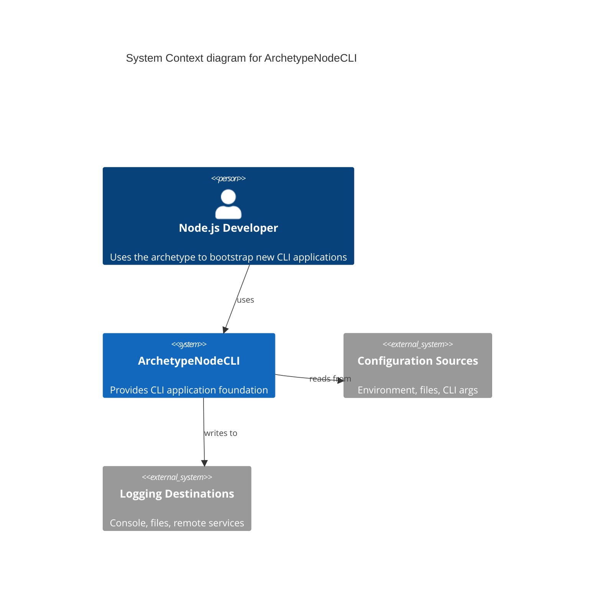

# **ArchetypeNodeCLI** Briefing

**ArchetypeNodeCLI** is a cli for Node.js developers that _provides a standardized foundation for building command-line applications with built-in configuration management, logging, and user interaction capabilities_

## Features

### F1-configuration-management

- Provides a robust configuration system supporting environment variables, config files, and command-line arguments with validation and type safety
- [F1-configuration-management](/docs/f1-configuration-management.blueprint.md)

### F2-structured-logging

- Implements a comprehensive logging system with different log levels, formatting options, and output destinations
- [F2-structured-logging](/docs/f2-structured-logging.blueprint.md)

### F3-interactive-commands

- Offers a flexible command system with interactive prompts, command validation, and help documentation generation
- [F3-interactive-commands](/docs/f3-interactive-commands.blueprint.md)

## Context diagram

- [Domain Model](/docs/domain-model.blueprint.md)

## System Specifications and Containers

- **Interaction**: cli
- **Authentication**: none
- **Integrations**: none
- **Monitoring**: operational
- **Persistence**: file_system

- [Systems architecture](/docs/systems-architecture.blueprint.md)

### C1 ArchetypeNodeCLI

- A node-cli that provides a standardized foundation for building command-line applications with built-in configuration management, logging, and user interaction capabilities

## Credits

- **Author**: [Alberto Basalo](https://albertobasalo.dev)
- **Company**: [AI code Academy](https://aicode.academy)
- **Repository**: [ArchetypeNodeCLI](https://github.com/AIcodeAcademy/ArchetypeNodeCLI)

## Related Blueprints

- [Domain Model Blueprint](/docs/domain-model.blueprint.md)

> End of Briefing Document for `ArchetypeNodeCLI`