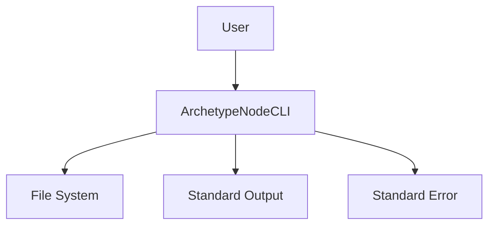

# **ArchetypeNodeCLI** Briefing

**ArchetypeNodeCLI** is a CLI for Node.js developers that _provides a clean, dependency-free template for building command-line applications_

## Features

### F1 Project Structure

- Provides a standardized project structure following Node.js best practices

- [f1-project-structure.blueprint.md](/docs/f1-project-structure.blueprint.md)

### F2 Command Handling

- Implements a robust command parsing and execution system

- [f2-command-handling.blueprint.md](/docs/f2-command-handling.blueprint.md)

### F3 Configuration

- Supports flexible configuration management through environment variables and config files

- [f3-configuration.blueprint.md](/docs/f3-configuration.blueprint.md)

### F4 Log Management

- Includes comprehensive logging capabilities for operational monitoring and debugging

- [f4-log-management.blueprint.md](/docs/f4-log-management.blueprint.md)

## Context diagram

- [Domain Model](/docs/domain-model.blueprint.md)

---

## System Specifications and Containers

- **Interaction**: CLI
- **Authentication**: none
- **Integrations**: none
- **Monitoring**: operational
- **Persistence**: file_system

### C1 NodeCLI

- A node-cli that serves as a template for building command-line applications

- [Systems architecture](/docs/systems-architecture.blueprint.md)

## Credits

- **Author**: [Alberto Basalo](https://albertobasalo.dev)
- **Company**: [AI code Academy](https://aicode.academy)
- **Repository**: [ArchetypeNodeCLI](https://github.com/AIcodeAcademy/ArchetypeNodeCLI)

## Related Blueprints

> End of Briefing Document for `ArchetypeNodeCLI` 