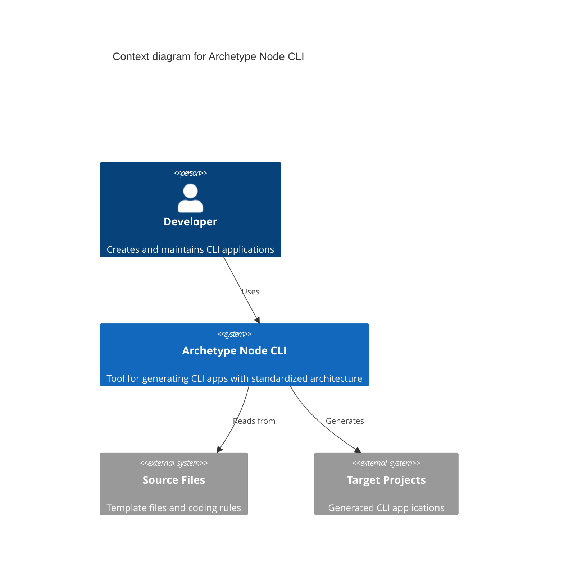

# **Archetype Node CLI** Briefing

**Archetype Node CLI** is a cli for developers that _generates and scaffolds CLI applications with pre-configured utilities and a standardized architecture_.

## Features

### F1-utilities-ecosystem

- Provides utilities for accessing Environment, Configuration and Writing Logs with a standardized approach.
- [F1-utilities-ecosystem Blueprint](/docs/F1/utilities-ecosystem.blueprint.md)

### F2-command-processing

- Adapters for processing commands and formatting outputs with minimal external dependencies.
- [F2-command-processing Blueprint](/docs//F2/command-processing.blueprint.md)

### F3-file-transformation

- Read files from source folder/file, transform content, write to target folders/files based on configurable paths.
- [F3-file-transformation Blueprint](/docs/F3/file-transformation.blueprint.md)

## Specifications

- **Interaction**: cli
- **Authentication**: none
- **Integrations**: none
- **Monitoring**: none
- **Persistence**: file_system
- **Dependencies**: minimal - only commander and chalk

## Context diagram

## Metadata

- **Author**: [Alberto Basalo](albertobasalo@aicode.academy)
- **Company**: [AI code Academy](https://aicode.academy)

## Related Documentation

- [Domain Model Blueprint](/docs/domain-model.blueprint.md)

_End of Briefing Document for Archetype Node CLI_