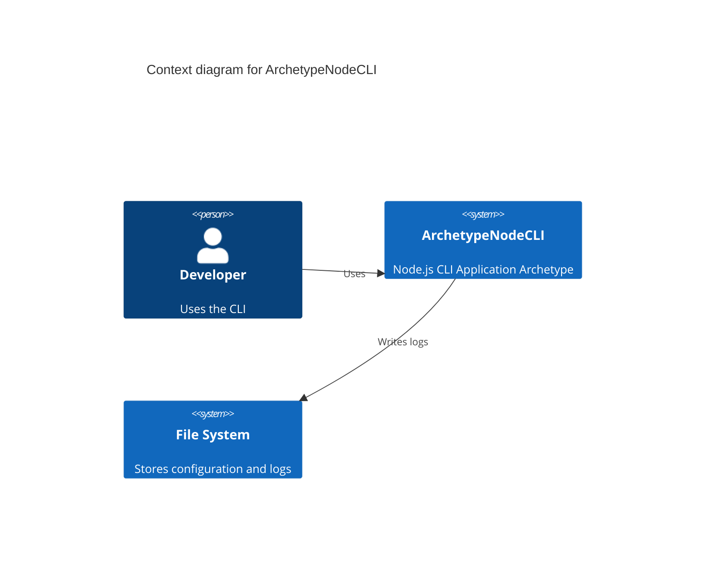

# **ArchetypeNodeCLI** Briefing

**ArchetypeNodeCLI** is a cli for developers that _serves as a reusable archetype for building other Node.js CLI applications._

## Features

### F1-environment-management
- Manage environment variables for different deployment stages (e.g., development, production).

### F2-configuration-management
- Handle application configuration loading from files or environment variables.

### F3-logging
- Provide a standardized logging mechanism for application events and errors.

### F4-command-handling
- Implement a basic command structure, including a help command to list available commands.

### F5-output-formatting
- Offer utilities for formatting console output consistently.

## Specifications

- **Interaction**: cli
- **Authentication**: none
- **Integrations**: none
- **Monitoring**: operational
- **Persistence**: file_system

## Context diagram

## Metadata

- **Author**: [Alberto Basalo](albertobasalo@aicode.academy)
- **Company**: [AI code Academy](https://aicode.academy)

## Related Blueprints

- [F1 Environment Management](/docs/f1-environment-management.blueprint.md)
- [F2 Configuration Management](/docs/f2-configuration-management.blueprint.md)
- [F3 Logging](/docs/f3-logging.blueprint.md)
- [F4 Command Handling](/docs/f4-command-handling.blueprint.md)
- [F5 Output Formatting](/docs/f5-output-formatting.blueprint.md)
<!-- - [Domain Model](/docs/domain-model.blueprint.md) -->
<!-- - [Systems Architecture](/docs/systems-architecture.blueprint.md) -->

_End of Briefing Document for ArchetypeNodeCLI_