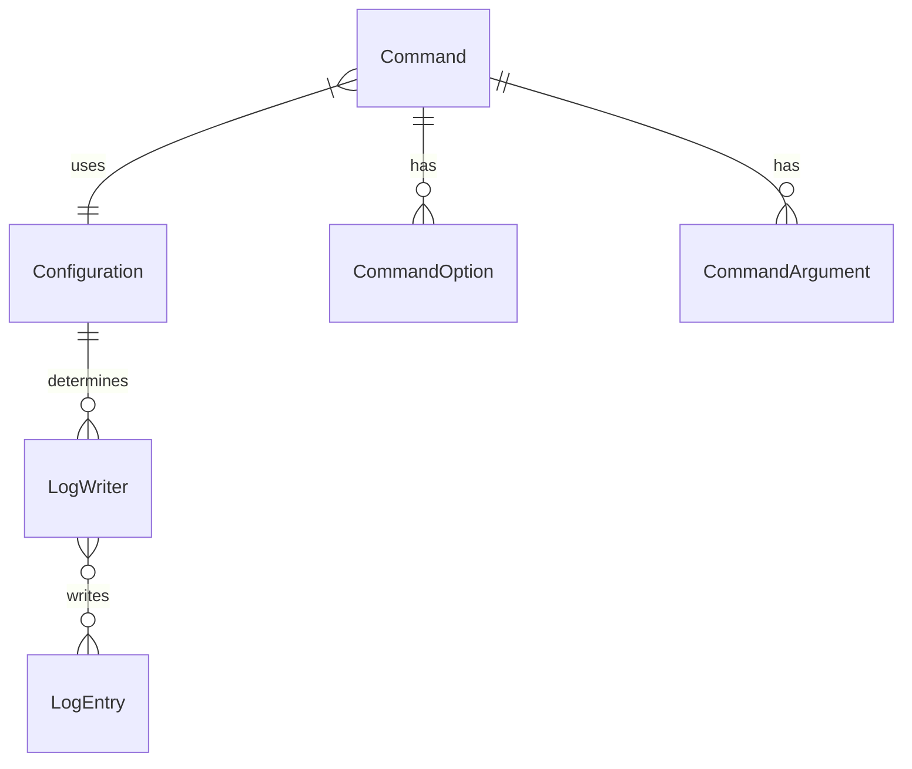

# Data Model for **ArchetypeNodeCLI**

This document describes the data model for the **ArchetypeNodeCLI** project. It covers the primary entities, their attributes, relationships, and provides a visual representation using a Entity-Relationship diagram.

It aims to establish a shared understanding (ubiquitous language) for business logic and system design.

### Reference

- [Briefing Blueprint](/docs/briefing.blueprint.md)
- [F1 Configuration Management](/docs/f1-configuration-management.blueprint.md)
- [F2 Structured Logging](/docs/f2-structured-logging.blueprint.md)
- [F3 Interactive Commands](/docs/f3-interactive-commands.blueprint.md)

## Entities

### Configuration

- **Description**: Represents the application configuration loaded from environment variables and custom sources
- **Attributes**:
  - **environment**: Record<string, any>
  - **custom**: Record<string, any>

### LogEntry

- **Description**: Represents a single log entry with structured data
- **Attributes**:
  - **timestamp**: Date
  - **level**: string (enum: 'debug' | 'info' | 'warn' | 'error')
  - **message**: string
  - **context**: Record<string, any>

### LogWriter

- **Description**: Represents a writer for log entries
- **Attributes**:
  - **name**: string
  - **type**: string (enum: 'console' | 'file' | 'remote')
  - **path**: string

### Command

- **Description**: Represents a CLI command with its definition and execution context
- **Attributes**:
  - **name**: string
  - **description**: string
  - **options**: CommandOption[]
  - **arguments**: CommandArgument[]
  - **handler**: Function
  - **validationRules**: ValidationRule[]

### CommandOption

- **Description**: Represents a command-line option
- **Attributes**:
  - **name**: string
  - **description**: string
  - **type**: string
  - **required**: boolean
  - **default?**: any

### CommandArgument

- **Description**: Represents a command-line argument
- **Attributes**:
  - **name**: string
  - **description**: string
  - **type**: string
  - **required**: boolean

## Relationships

- A Configuration determines the LogWriter
- A LogWriter writes multiple LogEntry
- A LogEntry is written by multiple LogWriter
- A Command has multiple CommandOption
- A Command has multiple CommandArgument

## Entity-Relationship Diagram

> End of Data Model Document for `ArchetypeNodeCLI` 