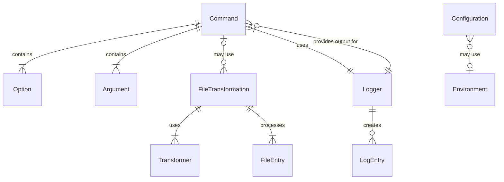

# Data Model for **Archetype Node CLI**

This document describes the data model for the **Archetype Node CLI** project. It covers the primary entities, their attributes, relationships, and provides a visual representation using a Entity-Relationship diagram.

It aims to establish a shared understanding (ubiquitous language) for business logic and system design.

### Reference

- [Briefing Blueprint](/docs/briefing.blueprint.md)
- [Features Blueprints inside /docs/feats/](/docs/F1/) [F2](/docs/F2/) [F3](/docs/F3/)

## Entities

### Command

- **Description**: Represents a command that can be executed by the CLI application
- **Attributes**:
  - **name!**: string
  - **description**: string
  - **options**: Option[]
  - **arguments**: Argument[]
  - **action**: Function
  - **group?**: string

### Option

- **Description**: Represents a command-line option for a command
- **Attributes**:
  - **flag!**: string
  - **description**: string
  - **defaultValue?**: any
  - **required**: boolean
  - **valueType**: string

### Argument

- **Description**: Represents a positional argument for a command
- **Attributes**:
  - **name!**: string
  - **description**: string
  - **required**: boolean
  - **valueType**: string

### Environment

- **Description**: Manages environment variables with type-safe access
- **Attributes**:
  - **configFilePath!**: string
  - **logLevel!**: string
  - **prefix?**: string
  - **nodeEnv?**: string

### Configuration

- **Description**: Manages application configuration with specific settings
- **Attributes**:
  - **sourceFolder!**: string
  - **targetFolder!**: string
  - **globs!**: string[]
  - **filePath?**: string
  - **environment?**: string

### Logger

- **Description**: Handles structured logging with different severity levels
- **Attributes**:
  - **level**: string
  - **useColors**: boolean
  - **outputStream**: NodeJS.WriteStream

### FileTransformation

- **Description**: Manages reading, transforming, and writing files
- **Attributes**:
  - **sourcePaths**: string[]
  - **targetPaths**: string[]
  - **transformers**: Transformer[]
  - **globPatterns?**: string[]

### FileEntry

- **Description**: Represents a file with its content and metadata
- **Attributes**:
  - **path!**: string
  - **content**: string
  - **metadata**: Record<string, any>
  - **transformedContent?**: string
  - **targetPath?**: string

### Transformer

- **Description**: Represents a function that transforms file content
- **Attributes**:
  - **name!**: string
  - **transform**: Function
  - **options?**: Record<string, any>

### LogEntry

- **Description**: Represents an individual log message with metadata
- **Attributes**:
  - **timestamp!**: Date
  - **level!**: string
  - **message!**: string
  - **context?**: Record<string, any>
  - **source?**: string
  - **correlationId?**: string

## Relationships

- Command contains zero or more Options and zero or more Arguments
- FileTransformation uses one or more Transformers to process files
- FileTransformation processes one or more FileEntries
- Configuration may use Environment for environment-specific settings
- Command uses Logger for output and error reporting
- Command may use FileTransformation for file processing operations
- Logger creates and manages many LogEntry instances

## Entity-Relationship Diagram

_End of Data Model Document for Archetype Node CLI_