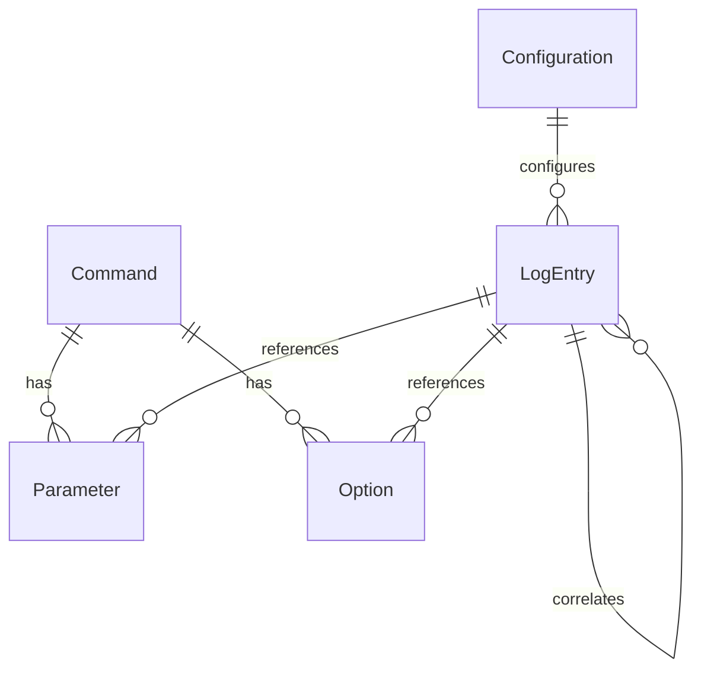

# Data Model for **ArchetypeNodeCLI**

This document describes the data model for the **ArchetypeNodeCLI** project. It covers the primary entities, their attributes, relationships, and provides a visual representation using a Entity-Relationship diagram.

It aims to establish a shared understanding (ubiquitous language) for business logic and system design.

### Reference

- [Briefing Blueprint](/docs/briefing.blueprint.md)
- [Project Structure](/docs/f1-project-structure.blueprint.md)
- [Command Handling](/docs/f2-command-handling.blueprint.md)
- [Configuration](/docs/f3-configuration.blueprint.md)
- [Log Management](/docs/f4-log-management.blueprint.md)

## Entities

### Command

- Represents an executable command in the CLI system
- **Attributes**:
  - **name!**: string
  - **description**: string
  - **aliases?**: string[]
  - **parameters?**: Parameter[]
  - **options?**: Option[]
  - **handler**: function

### Parameter

- Defines a command parameter with validation rules
- **Attributes**:
  - **name!**: string
  - **description**: string
  - **type**: string
  - **required**: boolean
  - **default?**: any
  - **validator?**: function

### Option

- Represents a command option or flag
- **Attributes**:
  - **name!**: string
  - **description**: string
  - **type**: string
  - **required**: boolean
  - **default?**: any
  - **aliases?**: string[]

### Configuration

- Manages application settings and preferences
- **Attributes**:
  - **settings!**: object
  - **environment**: string
  - **loadedFrom**: string
  - **lastModified**: Date

### LogEntry

- Represents a system event that needs to be logged or tracked
- **Attributes**:
  - **id!**: string
  - **type**: string (error|warning|info|debug)
  - **message**: string
  - **severity**: string
  - **context?**: object
  - **timestamp**: Date
  - **stackTrace?**: string
  - **source**: string
  - **correlationId?**: string

## Relationships

- A Command has zero or more Parameters
- A Command has zero or more Options
- A Command can have multiple aliases
- A Configuration can be loaded from multiple sources
- A LogEntry can reference Parameters and Options
- A LogEntry can be correlated with other LogEntries

## Entity-Relationship Diagram

> End of Data Model Document for `ArchetypeNodeCLI` 