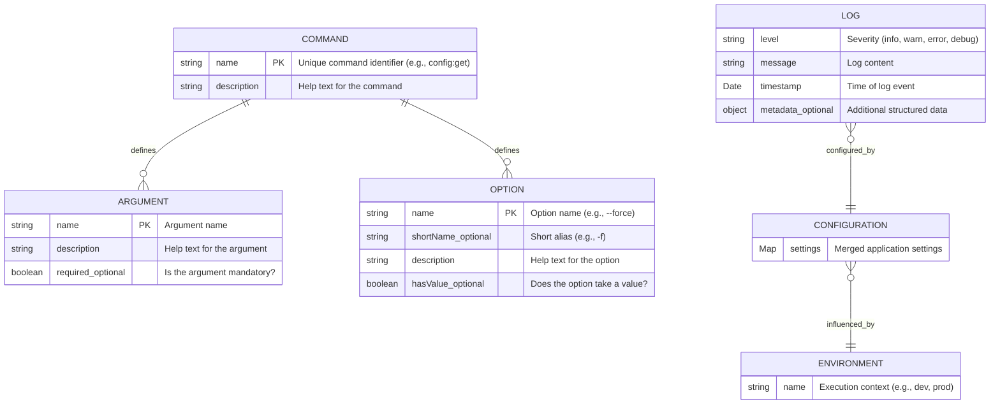

# Data Model for **ArchetypeNodeCLI**

This document describes the data model for the **ArchetypeNodeCLI** project. It covers the primary entities, their attributes, relationships, and provides a visual representation using a Entity-Relationship diagram.

It aims to establish a shared understanding (ubiquitous language) for business logic and system design.

Most of those entities will be persisted or loaded from a repository, but this is not a requirement. The data model is a conceptual representation of the system's structure and behavior. Include whatever you think is relevant for the project.

### Reference

- [Briefing Blueprint](/docs/briefing.blueprint.md)
- [Environment Management](/docs/f1-environment-management.blueprint.md)
- [Configuration Management](/docs/f2-configuration-management.blueprint.md)
- [Logging](/docs/f3-logging.blueprint.md)
- [Command Handling](/docs/f4-command-handling.blueprint.md)
- [Output Formatting](/docs/f5-output-formatting.blueprint.md)

## Entities

### Environment
- **Description**: Represents the execution context (e.g., 'development', 'production') influencing configuration and variable loading.
- **Attributes**:
  - **name**: string

### Configuration
- **Description**: Represents the application's settings, merged from files and environment variables.
- **Attributes**:
  - **settings**: Map<string, any>

### Log
- **Description**: Represents a single log entry generated by the application.
- **Attributes**:
  - **level**: string
  - **message**: string
  - **timestamp**: Date
  - **metadata?**: object

### Command
- **Description**: Defines a distinct action the CLI can perform, including its arguments and options.
- **Attributes**:
  - **name!**: string
  - **description**: string

### Argument
- **Description**: Defines an argument accepted by a Command.
- **Attributes**:
  - **name!**: string
  - **description**: string
  - **required?**: boolean

### Option
- **Description**: Defines an option (flag) accepted by a Command.
- **Attributes**:
  - **name!**: string
  - **shortName?**: string
  - **description**: string
  - **hasValue?**: boolean

## Relationships

- A `Command` defines zero or more `Argument`s.
- A `Command` defines zero or more `Option`s.
- The loaded `Configuration` is influenced by the active `Environment`.
- The logging system produces `Log` entries, and its behavior (level, format) is determined by the `Configuration`.

## Entity-Relationship Diagram

_End of Data Model Document for ArchetypeNodeCLI_
