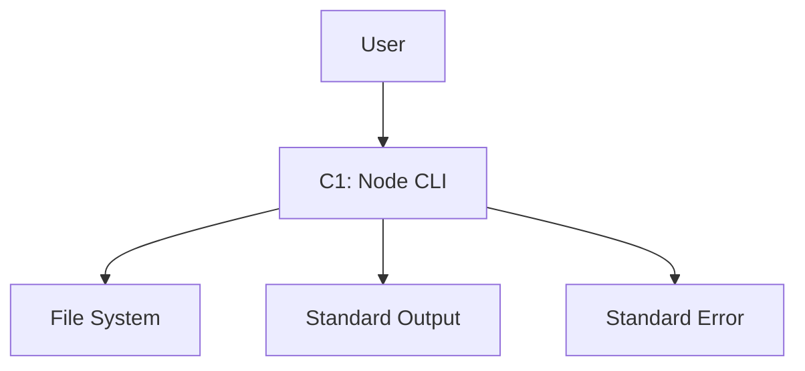

# System Architecture for **ArchetypeNodeCLI**

This document describes the system architecture for the project.
It covers the technical stack, component interactions, and deployment considerations.

### Reference

- [Briefing Blueprint](/docs/briefing.blueprint.md)
- [Domain Model Blueprint](/docs/domain-model.blueprint.md)
- [Project Structure](/docs/f1-project-structure.blueprint.md)
- [Command Handling](/docs/f2-command-handling.blueprint.md)
- [Configuration](/docs/f3-configuration.blueprint.md)
- [Log Management](/docs/f4-log-management.blueprint.md)

## Overview

ArchetypeNodeCLI is a command-line interface application built with Node.js that serves as a template for creating CLI applications. It follows a modular architecture with clear separation of concerns, focusing on command handling, configuration management, and logging capabilities. The system is designed to be lightweight, dependency-free, and easily extensible.

## System Containers

Here is the list of containers at a glance. See below for more details.

- **C1-node-cli** : Main CLI application container that handles command execution and user interaction

## C1 : Node CLI

- **Tier**: frontend
- **Archetype**: node-cli

The main container is a Node.js CLI application that serves as a template for building command-line applications. It implements a robust command parsing system, configuration management, and logging capabilities.

### Tech Stack

- **Language**: typescript
- **Runtime**: node
- **Framework**: vanilla_ts
- **API Style**: none

### Software Architecture

- **Pattern**: layered
- **Paradigm**: functional

### Security

- **Authentication**: none
- **Authorization**: none
- **Data Protection**: none

### Deployment

- **Hosting**: local
- **CI/CD**: package_json_scripts
- **Monitoring**: custom

## System Diagram

> End of Systems Document for `ArchetypeNodeCLI` 