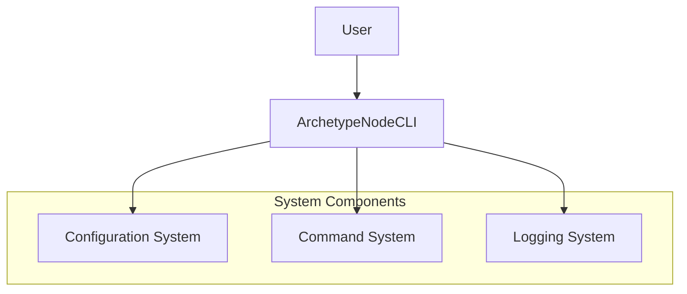

# System Architecture for **ArchetypeNodeCLI**

This document describes the system architecture for the project.
It covers the technical stack, component interactions, and deployment considerations.

### Reference

- [Briefing Blueprint](/docs/briefing.blueprint.md)
- [Domain Model Blueprint](/docs/domain-model.blueprint.md)
- [Project Initialization](/docs/f1-project-initialization.blueprint.md)
- [Configuration System](/docs/f2-configuration-system.blueprint.md)
- [Command Management](/docs/f3-command-management.blueprint.md)
- [Logging and Error Handling](/docs/f4-logging-error-handling.blueprint.md)

## Overview

ArchetypeNodeCLI is a Node.js-based command-line interface tool designed to streamline the creation of new Node.js CLI applications. The system follows a modular architecture with clear separation of concerns, focusing on configuration management, command handling, and logging capabilities. It adheres to Node.js best practices and provides a standardized template structure for CLI application development.

## System Containers

Here is the list of containers at a glance. See below for more details.

- **c1-node-cli** : The main CLI application container that handles user interactions and orchestrates the system components

## C1 : Node CLI

- **Tier**: frontend
- **Archetype**: node-cli

The main container is a Node.js CLI application that provides a standardized template and structure for creating new Node.js CLI applications. It handles user interactions, manages commands, and coordinates the system's core functionality.

### Tech Stack

- **Language**: typescript
- **Runtime**: node
- **Framework**: vanilla_ts
- **API Style**: none

### Software Architecture

- **Pattern**: layered
- **Paradigm**: functional

### Security

- **Authentication**: none
- **Authorization**: none
- **Data Protection**: none

### Deployment

- **Hosting**: local
- **CI/CD**: package_json_scripts
- **Monitoring**: custom

## System Diagram

> End of Systems Architecture Document for `ArchetypeNodeCLI` 