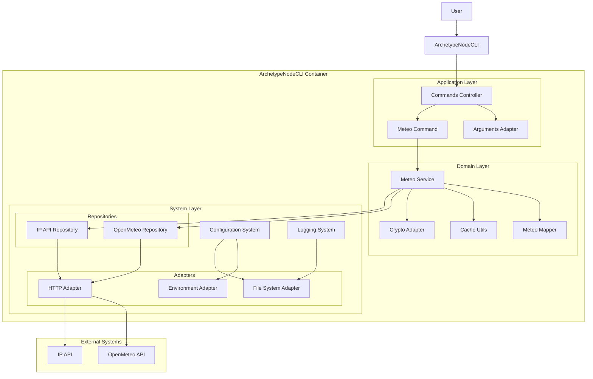

# Systems Architecture for ArchetypeNodeCLI

This document describes the system architecture for the project.
It covers the technical stack, component interactions, and deployment considerations.

### Reference

- [Briefing Blueprint](/docs/briefing.blueprint.md)
- [Domain Model Blueprint](/docs/domain-model.blueprint.md)

## Overview

ArchetypeNodeCLI is a Node.js-based command-line interface tool designed to streamline the creation of new Node.js CLI applications. The system follows a modular architecture with clear separation of concerns, focusing on configuration management, command handling, and logging capabilities. It adheres to Node.js best practices and provides a standardized template structure for CLI application development.

## System Containers

As this is an archetype, there is no containers per se. Itself is a prototype for a containerized application. In order to kees a standarized structure will name it the C0 Container.

## C0 : Node CLI

- **Tier**: frontend
- **Archetype**: node-cli

The main container is a Node.js CLI application that provides a standardized template and structure for creating new Node.js CLI applications. It handles user interactions, manages commands, and coordinates the system's core functionality.

- [Archetype Node CLI](/containers/c0-node-cli/docs/node-cli.archetype.md)

### Tech Stack

- **Language**: typescript
- **Runtime**: node
- **Framework**: vanilla_ts
- **API Style**: none

### Software Architecture

- **Pattern**: layered
- **Paradigm**: functional and object-oriented

### Security

- **Authentication**: none
- **Authorization**: none
- **Data Protection**: none

### Deployment

- **Hosting**: local
- **CI/CD**: package_json_scripts
- **Monitoring**: custom

## System Diagram

> End of Systems Architecture Document for `ArchetypeNodeCLI` 

