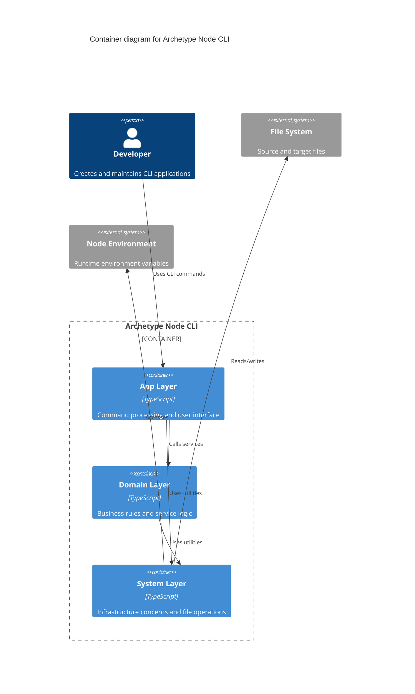

# System Architecture for **Archetype Node CLI**

This document describes the system architecture for the project.
It covers the technical stack, component interactions, and deployment considerations.

### Reference

- [Briefing Blueprint](/docs/briefing.blueprint.md)
- [Features Blueprints inside /docs/F1/](/docs/F1/) [F2](/docs/F2/) [F3](/docs/F3/)
- [Domain Model Blueprint](/docs/domain-model.blueprint.md)

## Overview

Archetype Node CLI is a TypeScript-based command-line tool designed with a layered, functional architecture that provides a foundation for generating CLI applications. It leverages minimal external dependencies while offering robust utilities for environment management, configuration, logging, command processing, and file transformations to standardize the development of command-line tools.

## System Containers

Here is the list of containers at a glance. See below for more details.

- **C1_node-cli** : A command-line application that provides utilities and scaffolding for generating CLI applications with standardized architecture.

## Archetype Node CLI

- **Tier**: frontend
- **Archetype**: node-cli
- **Code**: C1_node-cli

Archetype Node CLI serves as both a functional CLI tool and a reference implementation for building CLI applications. It implements a layered architecture with clear separation of concerns between presentation (app), domain logic, and infrastructure (system) layers. The tool provides standardized utilities, command processing adapters, and file transformation capabilities, all designed around functional programming principles with strong typing.

### Tech Stack

- **Language**: typescript
- **Runtime**: node
- **Framework**: vanilla_ts
- **API Style**: none

### Software Architecture

- **Pattern**: layered
- **Paradigm**: functional

### Security

- **Authentication**: none
- **Authorization**: none
- **Data Protection**: none

## Deployment

### Infrastructure

- **Hosting**: github
- **CI/CD**: package_json_scripts
- **Monitoring**: none

## System Diagram

