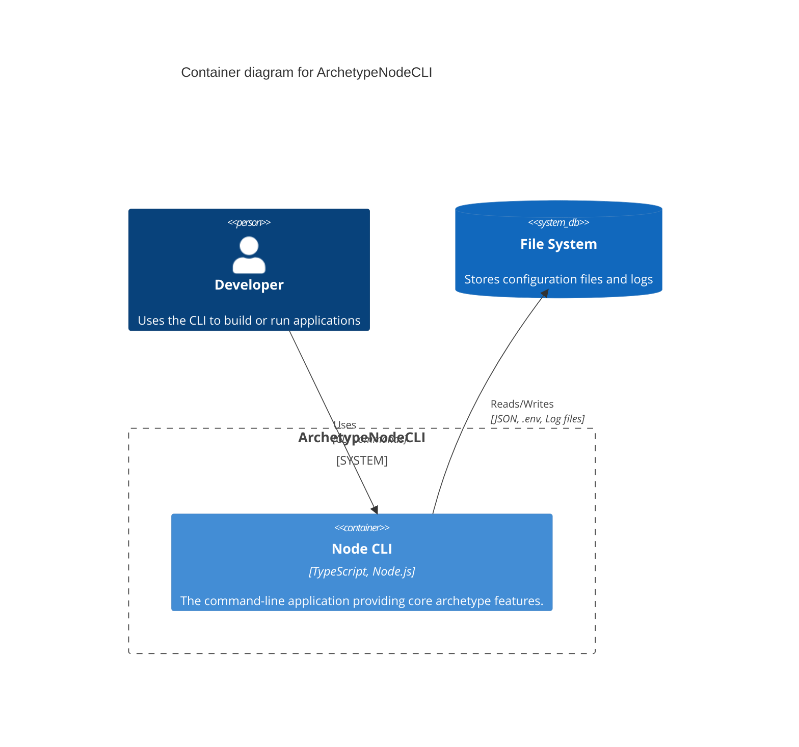

# System Architecture for **ArchetypeNodeCLI**

This document describes the system architecture for the project.
It covers the technical stack, component interactions, and deployment considerations.

### Reference

- [Briefing Blueprint](/docs/briefing.blueprint.md)
- [Domain Model Blueprint](/docs/domain-model.blueprint.md)
- [Environment Management](/docs/f1-environment-management.blueprint.md)
- [Configuration Management](/docs/f2-configuration-management.blueprint.md)
- [Logging](/docs/f3-logging.blueprint.md)
- [Command Handling](/docs/f4-command-handling.blueprint.md)
- [Output Formatting](/docs/f5-output-formatting.blueprint.md)

## Overview

ArchetypeNodeCLI is a command-line interface designed for developers, serving as a foundational archetype for building other Node.js CLI applications. It manages environment variables, configuration, logging, command execution, and output formatting, interacting primarily with the local file system.

Here is the list of containers at a glance. See below for more details.

- **C1-node-cli** : A command-line interface archetype built with Node.js.

## C1 : Node CLI

- **Tier**: frontend
- **Archetype**: node-cli

This container represents the core Node.js command-line application, providing a reusable structure for building CLIs. It handles environment variables, configuration, logging, command parsing, and output formatting.

### Tech Stack

- **Language**: typescript
- **Runtime**: node
- **Framework**: vanilla_ts

### Software Architecture

- **Pattern**: layered
- **Paradigm**: functional

### Security

- **Authentication**: none
- **Authorization**: none
- **Data Protection**: none

### Deployment

- **Hosting**: local
- **CI/CD**: package_json_scripts
- **Monitoring**: custom

## Integrations

### External Services

- **APIs**: none
- **Payments**: none
- **AI/ML**: none
- **Storage**: none
- **Email**: none
- **Other**: none

## System Diagram

