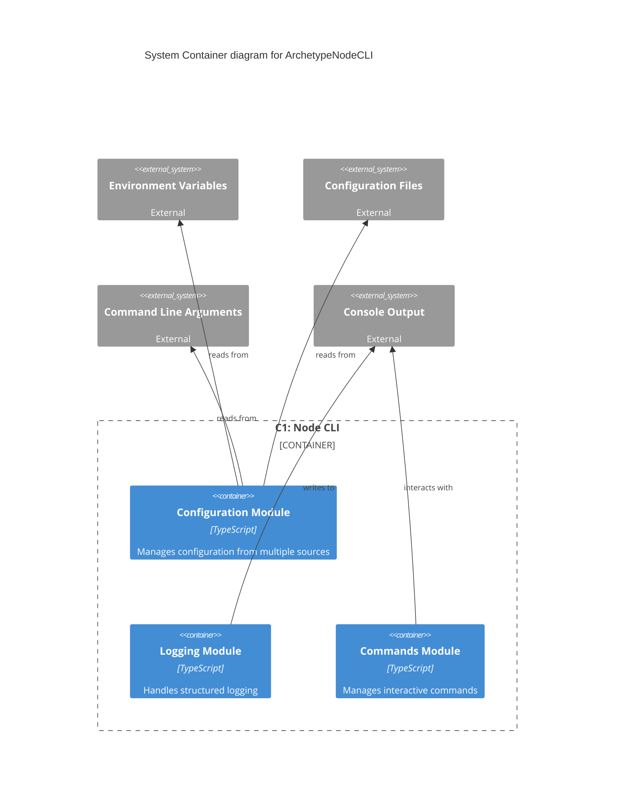

# System Architecture for **ArchetypeNodeCLI**

This document describes the system architecture for the project.
It covers the technical stack, component interactions, and deployment considerations.

### Reference

- [Briefing Blueprint](/docs/briefing.blueprint.md)
- [Domain Model Blueprint](/docs/domain-model.blueprint.md)
- [F1 Configuration Management](/docs/f1-configuration-management.blueprint.md)
- [F2 Structured Logging](/docs/f2-structured-logging.blueprint.md)
- [F3 Interactive Commands](/docs/f3-interactive-commands.blueprint.md)

## Overview

ArchetypeNodeCLI is a command-line interface (CLI) application built with Node.js and TypeScript, designed to provide a standardized foundation for building CLI applications. The system focuses on three core features: configuration management, structured logging, and interactive commands. It follows a modular architecture with clear separation of concerns and type safety throughout the codebase.

## System Containers

Here is the list of containers at a glance. See below for more details.

- **C1-node-cli** : A Node.js CLI application that provides configuration management, logging, and interactive command capabilities

## C1 : Node CLI

- **Tier**: backend
- **Archetype**: node-cli

The main container is a Node.js CLI application that serves as the foundation for building command-line tools. It provides a robust configuration system, structured logging capabilities, and interactive command handling.

### Tech Stack

- **Language**: typescript
- **Runtime**: node
- **Framework**: vanilla_ts
- **API Style**: none

### Software Architecture

- **Pattern**: layered
- **Paradigm**: functional

### Security

- **Authentication**: none
- **Authorization**: none
- **Data Protection**: none

### Deployment

- **Hosting**: local
- **CI/CD**: package_json_scripts
- **Monitoring**: custom

## System Diagram

> End of Systems Document for `ArchetypeNodeCLI` 